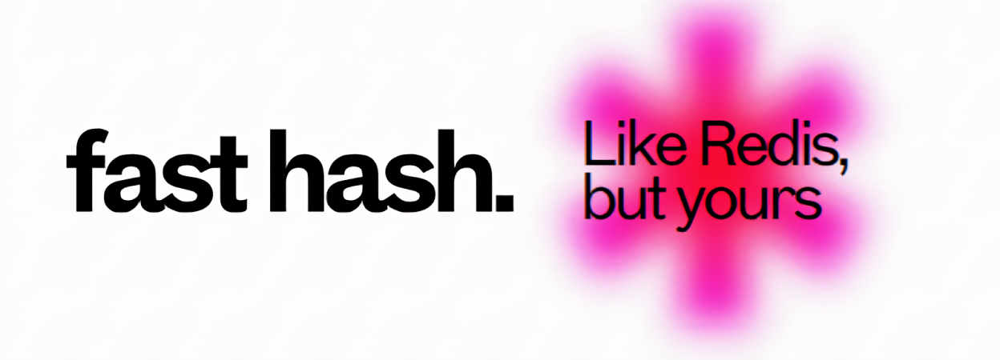

  

# FastHash

**FastHash** is a lightweight, fast, and minimal in-memory key-value store built in modern C++.  
It is inspired by Redis and designed for learning, performance, and extensibility.

---

## Features

- In-memory key-value storage
- TTL support with automatic expiration
- Thread-safe operations using mutexes
- Background sweeper thread to remove expired keys
- Redis-like CLI commands: `SET`, `GET`, `DEL`, `EXPIRE`, `TTL`, `SETEX`
